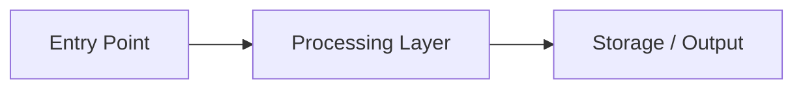
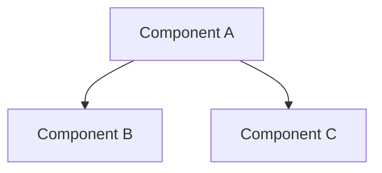
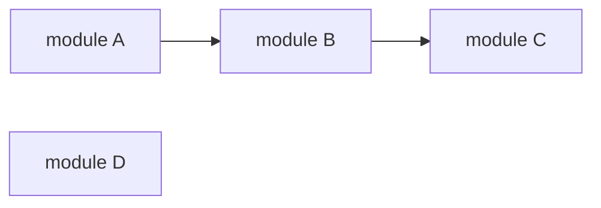

# Reference — Document Templates

> **Convention:** Mark any field you cannot directly confirm from code with `⚠️ inferred` inline.
> Example: `Pattern: Hexagonal ⚠️ inferred`
> Users should review and correct all inferred fields.

---

## READREPO.md — `learn` mode

For learners who want to understand how a project works.

```markdown
> 🔍 Generated in **learn** mode by [read-repo](https://github.com/T3QC0LU/read-repo). Re-run with "analyze this repo for someone taking over" or "analyze this repo for contributing" to switch modes.

# {Project Name}

> {One-sentence description of what this project does and for whom.}

## Overview

{2–3 paragraphs: what problem it solves, who uses it, what makes it interesting to learn.}

## Tech Stack

| Layer | Technology |
|---|---|
| Language | … |
| Framework | … |
| Database | … |
| Infrastructure | … |

## How It Works

{Data flow narrative — follow the path from user input to output. Be concrete.}



## Where to Start Reading

Recommended reading order for someone new to this codebase:

1. `{file}` — {why start here}
2. `{file}` — {what it reveals}
3. `{file}` — {what it explains}

## Key Concepts

| Concept | Explanation |
|---|---|
| {Term} | {What it means in this codebase specifically} |

## Folder Map

```
/
├── {dir}/     # {responsibility}
├── {dir}/     # {responsibility}
└── …
```

## ⚡ Core Insights

Non-obvious things worth knowing before you read the code deeply.

- **{Insight}**: {Explanation} _(confirmed / ⚠️ inferred)_

## Open Questions

Things this analysis could not confirm — verify before relying on them:

- `⚠️` {field}: {what's uncertain and how to verify}
```

---

## READREPO.md — `takeover` mode

For developers who are inheriting or joining an existing codebase.

```markdown
> 🔍 Generated in **takeover** mode by [read-repo](https://github.com/T3QC0LU/read-repo). Re-run with "analyze this repo to learn it" or "analyze this repo for contributing" to switch modes.

# {Project Name} — Takeover Guide

> {One-sentence description.}

## The Big Picture

{What this system does, who depends on it, what breaks if it goes down. 2–3 sentences.}

## Tech Stack

| Layer | Technology |
|---|---|
| Language | … |
| Framework | … |
| Database | … |
| Infrastructure | … |

## Module Responsibilities

| Module / Dir | Owns | Does NOT own |
|---|---|---|
| `{dir}` | {what it's responsible for} | {common misconceptions} |

## Architecture

{Pattern name} ⚠️ inferred — {one-sentence justification}



Things that have bitten people before or that look wrong but are intentional:

- **{Pitfall}**: {What it is, why it exists, what to do / not do}

## Non-obvious Decisions

Decisions that look strange without context:

- **{Decision}**: {What it is} → {Why it was made this way}

## ⚡ Core Insights

- **{Insight}**: {Explanation} _(confirmed / ⚠️ inferred)_

## Open Questions

- `⚠️` {field}: {what's uncertain}

→ See [ONBOARDING.md](ONBOARDING.md) for setup and local dev instructions.
```

---

## READREPO.md — `hack` mode

For open-source contributors and developers who want to fork or extend the project.

```markdown
> 🔍 Generated in **hack** mode by [read-repo](https://github.com/T3QC0LU/read-repo). Re-run with "analyze this repo to learn it" or "analyze this repo for someone taking over" to switch modes.

# {Project Name} — Contributor Guide

> {One-sentence description.}

## What This Is

{What the project does. What it is NOT. What kind of contributions are in scope.}

## Tech Stack

| Layer | Technology |
|---|---|
| Language | … |
| Framework | … |
| Database | … |
| Infrastructure | … |

## Extension Points

Where the code is designed to be extended:

| Extension point | Location | How to extend |
|---|---|---|
| {name} | `{path}` | {instructions} |

## Hardcoded Values to Know About

Values that are not configurable and that you'll need to change if forking:

- `{location}`: {what it is, why it's hardcoded}

## Dependency Map

How the key modules depend on each other:



→ See [ARCHITECTURE.md](ARCHITECTURE.md) for full breakdown.

## Test Coverage

| Area | Test location | Coverage signal |
|---|---|---|
| {area} | `{path}` | {good / partial / none ⚠️ inferred} |

## ⚡ Core Insights

- **{Insight}**: {Explanation} _(confirmed / ⚠️ inferred)_

## Open Questions

- `⚠️` {field}: {what's uncertain and where to look}

→ See [TECH-STACK.md](TECH-STACK.md) for full dependency details.
```

---

## ARCHITECTURE.md

```markdown
# Architecture

## Pattern

**{Pattern}** ⚠️ inferred — {Why this pattern fits this project.}

## Component Map


1. {Step}: {description}
2. …

## Key Design Decisions

| Decision | Rationale | Trade-off |
|---|---|---|
| … | … | … |

## Layers

### {Layer Name}
- Location: `{path}`
- Responsibility: {description}
- Key files: `{file}` — {purpose}

## External Integrations

| Service | Protocol | Purpose |
|---|---|---|
| … | … | … |
```

---

## TECH-STACK.md

```markdown
# Tech Stack

## Languages

| Language | Usage | File count (approx) |
|---|---|---|
| … | … | … |

## Frameworks & Libraries

| Package | Version | Purpose | Why chosen |
|---|---|---|---|
| … | … | … | … ⚠️ inferred |

## Infrastructure

| Tool | Purpose |
|---|---|
| … | … |

## Development Tools

| Tool | Purpose |
|---|---|
| … | … |

## Upgrade Notes

{Any pinned versions with known issues or upgrade blockers.}
```

---

## FOLDER-GUIDE.md

```markdown
# Folder Guide

> What lives where and why — quick reference for contributors.

## Source Tree

```
{tree output}
```

## Folder Responsibilities

### `/{folder}`

**Purpose**: {one sentence}

**Key files**:
- `{file}` — {role}

---

{repeat per folder}

## Where to Add New…

| Thing | Where |
|---|---|
| New API endpoint | `{path}` |
| New UI component | `{path}` |
| New DB migration | `{path}` |
| New test | `{path}` |
```

---

## ONBOARDING.md

```markdown
# Onboarding Guide

## Prerequisites

- {tool} {version+}
- …

## Local Setup

```bash
# Step-by-step, copy-pasteable commands
```

## Environment Variables

| Variable | Required | Default | Description |
|---|---|---|---|
| … | ✅ | — | … |

## Running Tests

```bash
{test command}
```

## Common Issues

### {Issue title}
**Symptom**: …
**Fix**: …

## Useful Commands

| Command | What it does |
|---|---|
| … | … |
```

